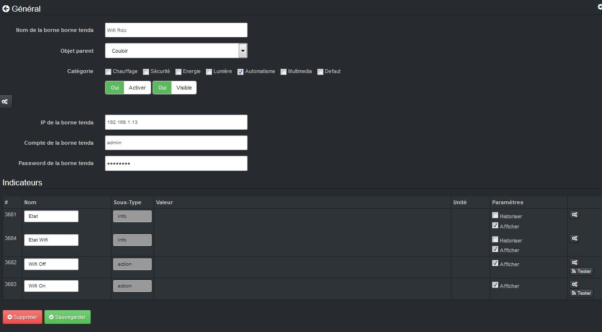

# Plugin Borne Tenda W301A pour Jeedom

Plugin permettant de gérer les Bornes Tenda W301A.

### Market

Retrouvez le sur le Market Jeedom [ici](https://www.jeedom.com/market/index.php?v=d&p=market&type=plugin&name=bornetenda)

### Documentation

Vous trouverez la documentation [ici](https://github.com/Jeedom-Plugins-Extra/plugin-bornetenda/blob/master/docs/fr_FR/index.md)

### Prévisualisation

### Forum

Lien vers le forum [ici](https://www.jeedom.com/forum/viewtopic.php?f=28&t=5279)

### Chatroom

Lien vers le chat [ici](https://gitter.im/Jeedom-Plugins-Extra/plugin-bornetenda)

### Fonctions disponibles

Infos :
* Status de la borne
* Status du Wifi

Actions :
* Activer le Wifi
* Désactiver le Wifi

Scénarios possible (ceux que j'ai chez moi) :
* Activation/désactivation du Wifi sur plage horaire

## <a href="https://creativecommons.org/licenses/by-sa/4.0/"> Team Jeedom-Plugins-Extra </a> 👍
### Retour à l'accueil du [Wiki](https://github.com/Jeedom-Plugins-Extra/Jeedom-Plugins-Extra/wiki) ou de la [Team](https://github.com/Jeedom-Plugins-Extra)
